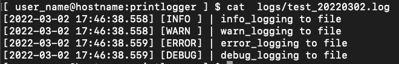

# printlogger
+ log color print
+ log file write

# Language

<!---->

# PKG install 
```console
pip install git+https://github.com/HonamSong/printlogger.git
```

# Usage

## Logging class attribute
```python
class Logging:
    def __init__(self, log_path=None, log_file=None,
                 log_color='green', log_level='INFO', log_mode='print',
                 log_time_format=None, view_log=True,
                 view_line_num=False, view_file_name=False, view_func_name=False):

    :param log_path: logging path name ( default: ./logs)
    :param log_file: logging file name (default: ./script_name_yyyymmdd.log)
    :param log_color: print log color (default: green)
    :param log_level: logging level (default: INFO)
    :param log_mode: print or loging mode ( default : print), [all|write|print]
    :param log_time_format : logging Time format (default YYYY-MM-DD HH:MM:SS:3F)
    :param view_view : View logs by default True (Do Not print boolean is False)
    :param view_line_num : view logs in line number
    :param view_func_name : view logs in function name + line number
    :param view_file_name : view logs in file name + line number
```

### Default level color print logger
```python
from printlogger import *

logging = Logging()
# is_view can be skipped
logging.info("info_text", is_view=True)
logging.warn("warn_text", is_view=True)
logging.error("error_text", is_view=True)
logging.debug("debug_text", is_view=True)
```


### user custom print logger
```python
from printlogger import *

logging = Logging()
logging.custom("custom logger", "yellow", "warn", is_view=True)
```


### print color list
color|attribute
---|---
|green (default info color)
|magenta (default warn color)
|red (default error color)
|yellow (default debug color)
|blue
|grey
|cyan
|white


# Only write logging to file
```python
from printlogger import *

logging = Logging(log_mode="write")
# When log_mode is write, it is not output even if is_view is True.
logging.info('info_logging to file', is_view=True)
logging.warn('warn_logging to file', is_view=True)
logging.error('error_logging to file', is_view=True)
logging.debug('debug_logging to file', is_view=True)

```


# print and write to file : log_mode=all
```python
from printlogger import *

logging = Logging(log_mode="all")
logging.info('info_logging print and write file', is_view=True)
logging.warn('warn_logging print and write file', is_view=True)
logging.error('error_logging print and write file', is_view=True)
logging.debug('debug_logging print and write file', is_view=True)
```

